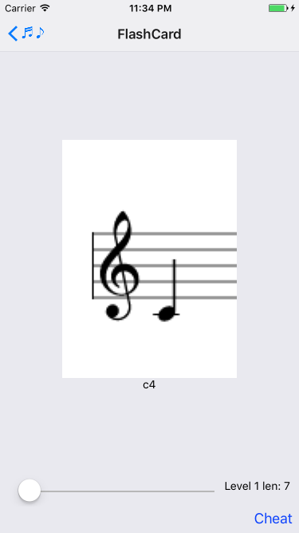

# music-notes

Music notes reading flash card app using react-native (not-complete)

Mobile version of https://github.com/palaniraja/letsreadnotes

[My Notes](docs/tasks.md)

---

## Demo

## Screenshots

  

